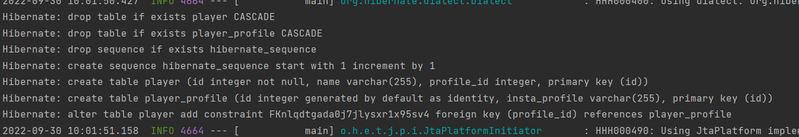
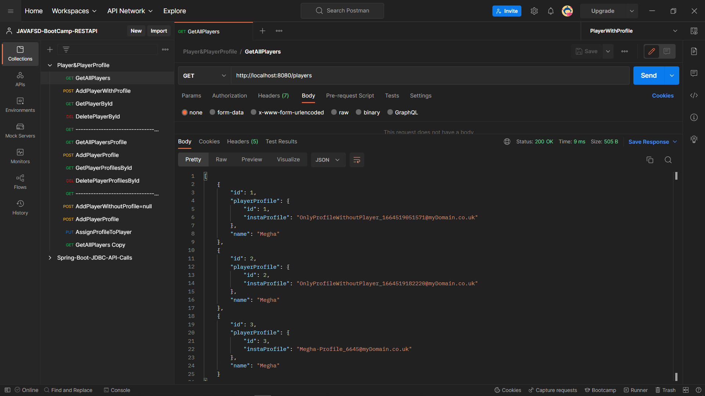
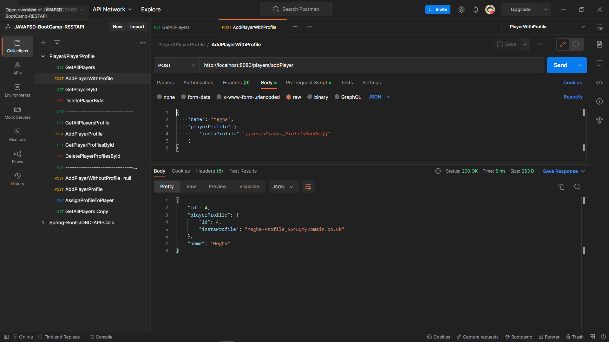
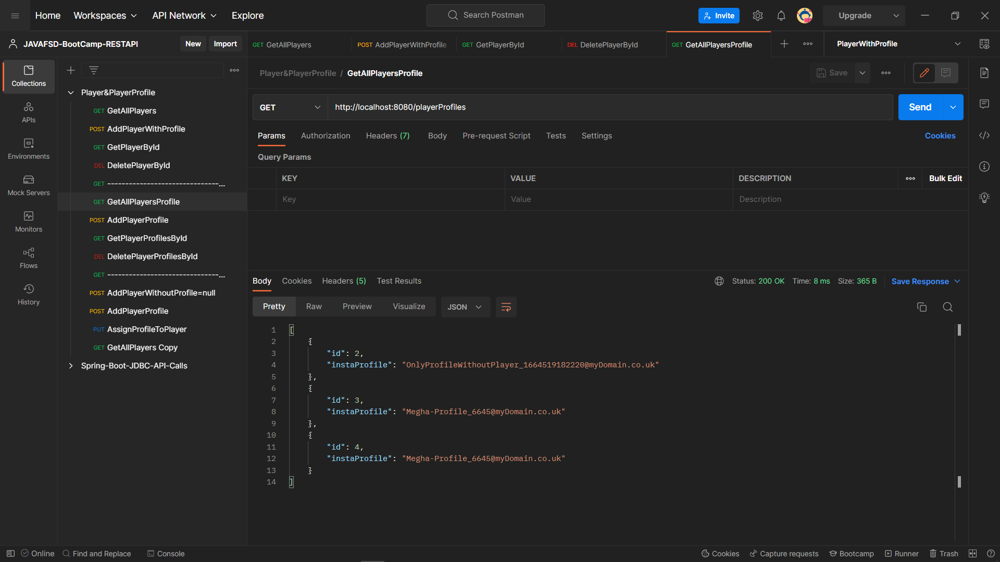
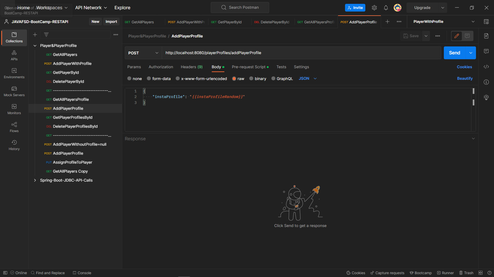
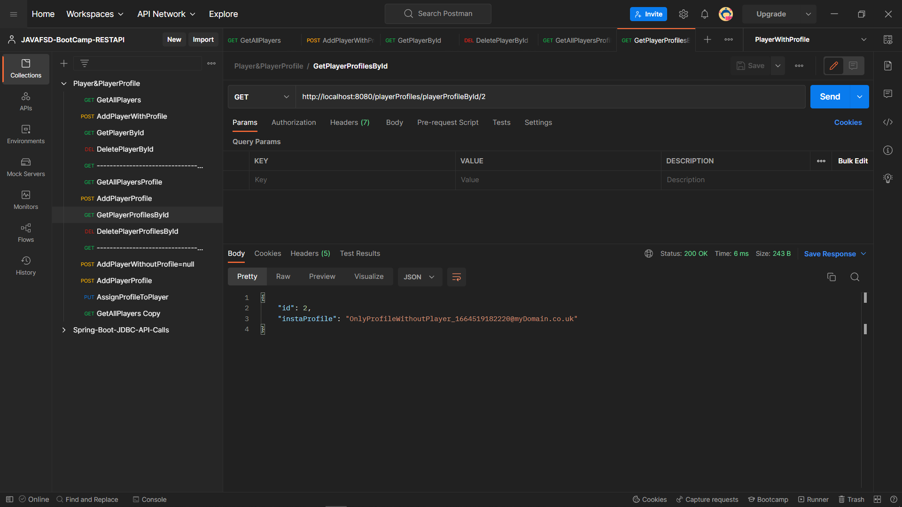
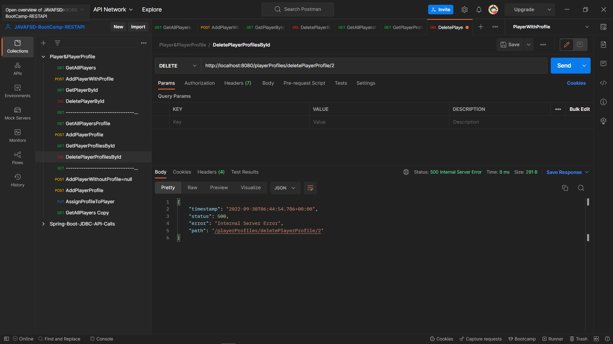
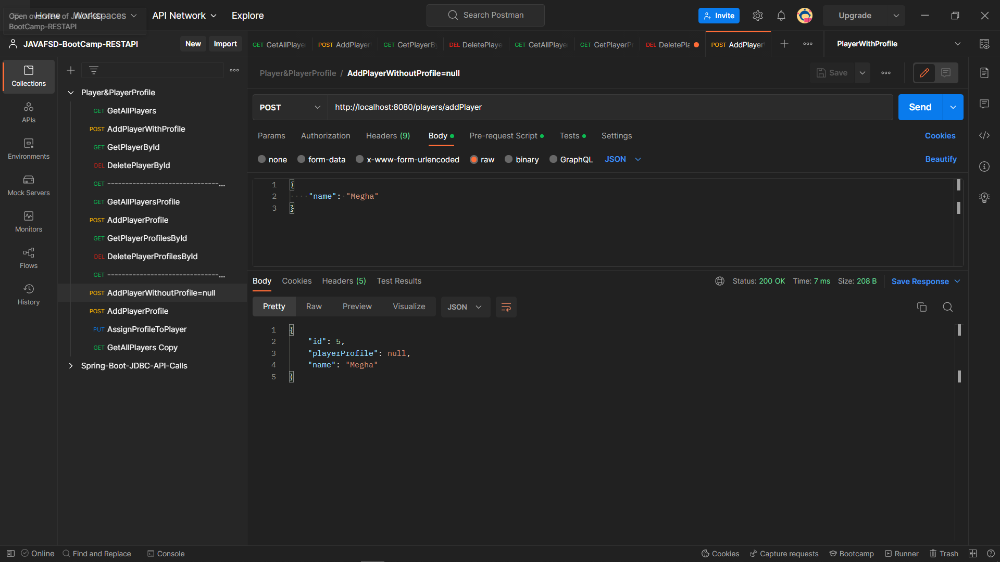
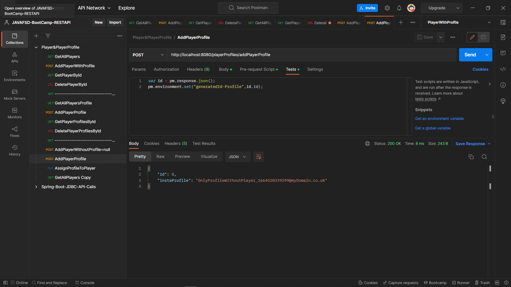
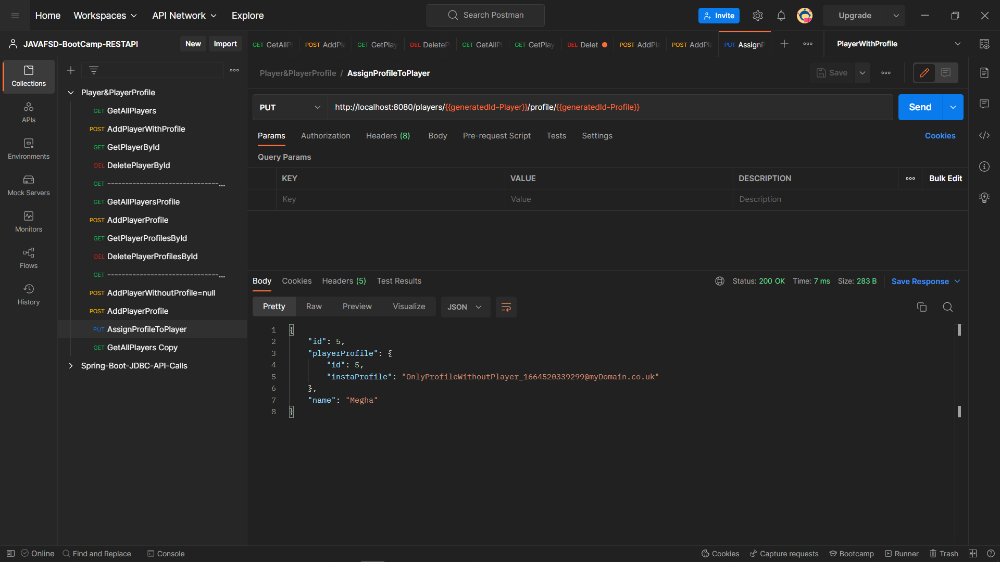

# SQL

## => (PK )Primary Key: Unique Key for identifying a row in a table

## => (FK) Foreign Key: Whenever we have your primary key placed in another table => reference to the actual that table has your primary key => Link the records

# Relationships

## One-One




### GetALLPlayers


### AddPlayerWithProfileObject

```
Pre-Request:
 var name = pm.request.body;
 const obj = JSON.parse(name.raw);
 pm.environment.set("instaPlayer_ProfileRandom",`${obj.name}-Profile_${Date.now().toString().substring(1,5)}@myDomain.co.uk`);
```

### GetPlayerById


### DeletePlayerById


### ----------------------------------------------------

### GetALLPlayerProfiles


### AddPlayerProfile

```
Pre-Request:
 pm.environment.set("instaProfileRandom", `OnlyProfileWithoutPlayer_${Date.now()}@myDomain.co.uk`)
```

### GetPlayerProfileById


### DeletePlayerProfileById

```
If Profile is assign to any player then we can't delete it.
but If profile is not assign then we can.
```


### ----------------------------------------------------

### Add Player Without Player

```
Pre-Request:
 var name = pm.request.body;
 const obj = JSON.parse(name.raw);
 pm.environment.set("instaPlayer_ProfileRandom",`${obj.name}-Profile_${Date.now().toString().substring(1,5)}@myDomain.co.uk`);

Test:
 var id = pm.response.json();
 pm.environment.set("generatedId-Player",id.id);
```
### Add Profile

```
Pre-Request:
 pm.environment.set("instaProfileRandom", `OnlyProfileWithoutPlayer_${Date.now()}@myDomain.co.uk`)

Test:
 var id = pm.response.json();
 pm.environment.set("generatedId-Profile",id.id);
```
## Assign Profile to a Player



## One-Many


## Many-Many


