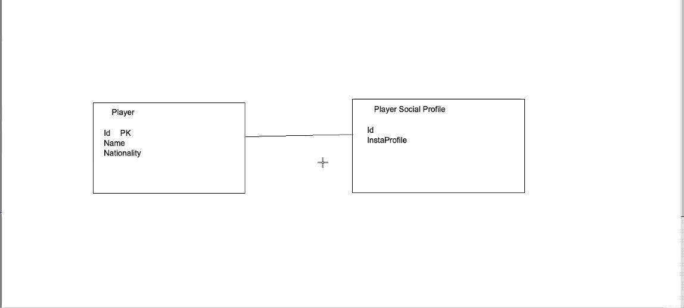
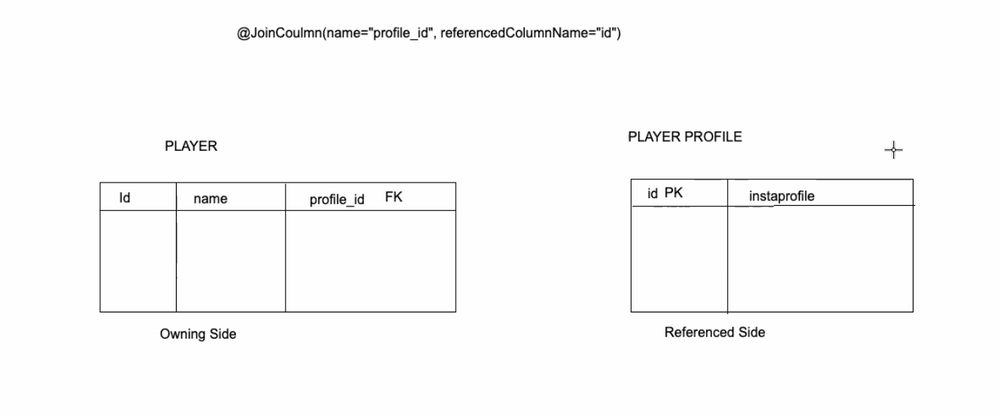
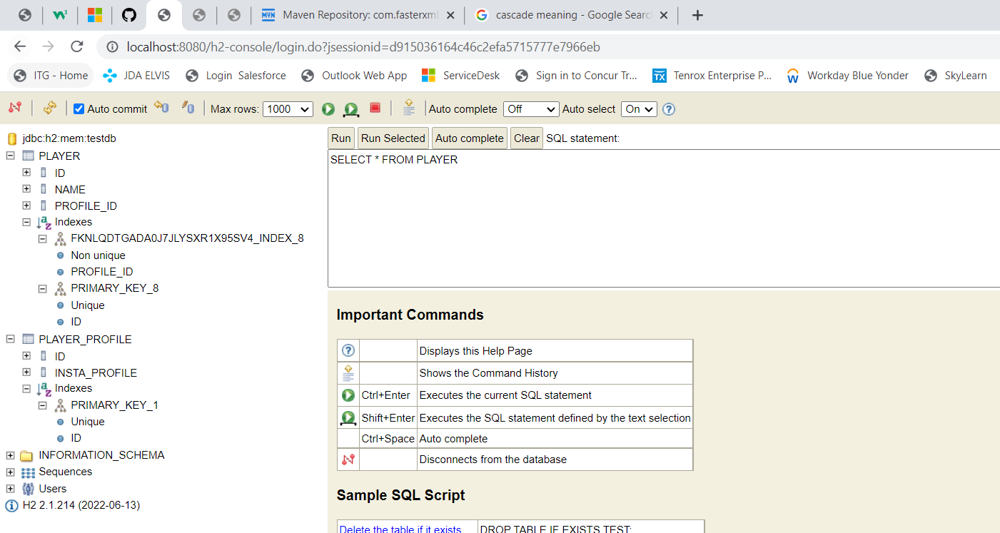
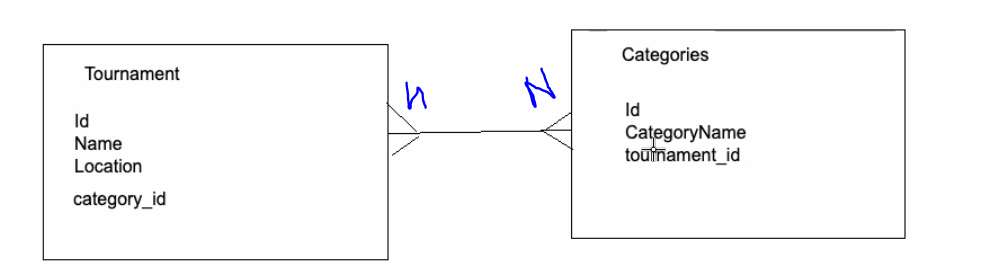

# SQL

## => (PK )Primary Key: Unique Key for identifying a row in a table

## => (FK) Foreign Key: Whenever we have your primary key placed in another table => reference to the actual that table has your primary key => Link the records

# Relationships

### One-One

### One-Many

### Many-Many

