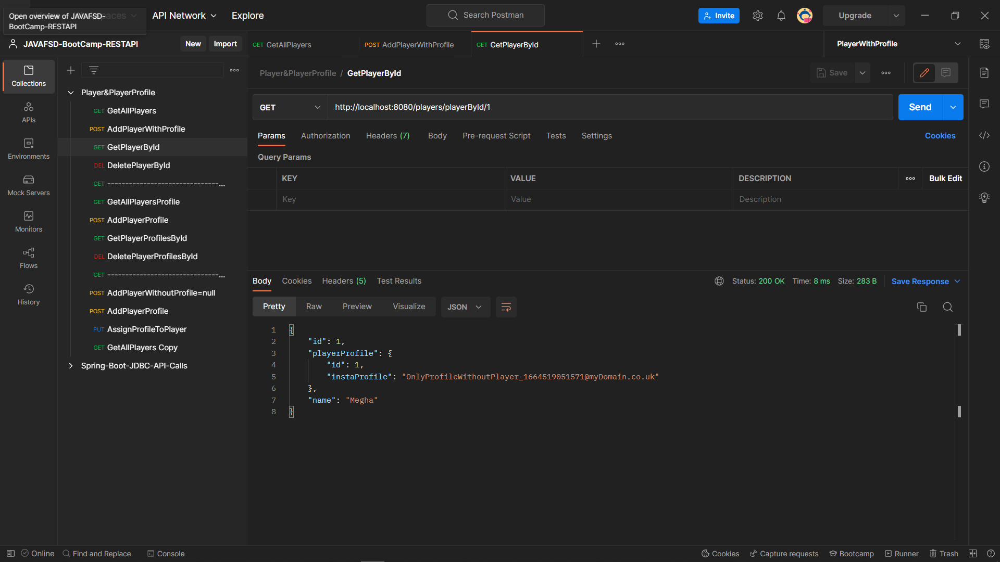
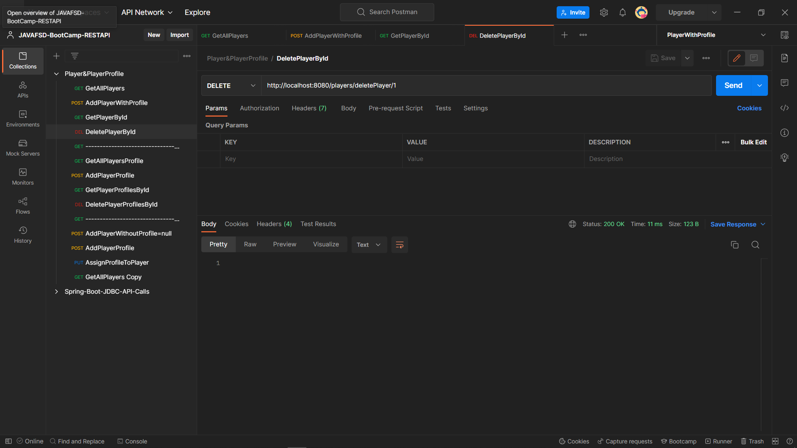
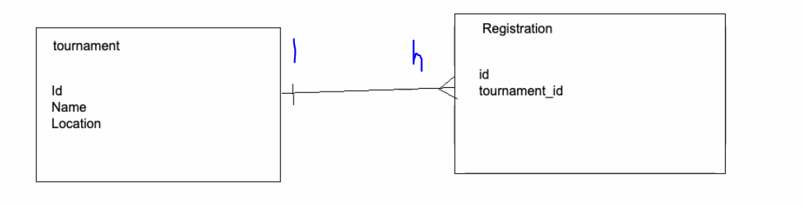

# SQL

## => (PK )Primary Key: Unique Key for identifying a row in a table

## => (FK) Foreign Key: Whenever we have your primary key placed in another table => reference to the actual that table has your primary key => Link the records

# Relationships

## One-One

### GetALLPlayers

### AddPlayerWithProfileObject

### GetPlayerById

### DeletePlayerById

### ----------------------------------------------------

### GetALLPlayerProfiles

### AddPlayerProfile

### GetPlayerProfileById

### DeletePlayerProfileById

### ----------------------------------------------------

### Add Player Without Player

### Add Profile

## Assign Profile to a Player

## One-Many

## Many-Many

